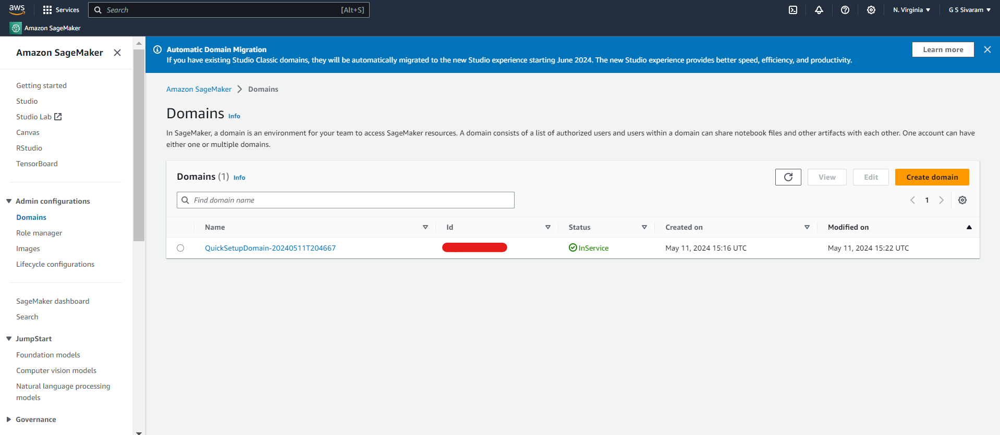
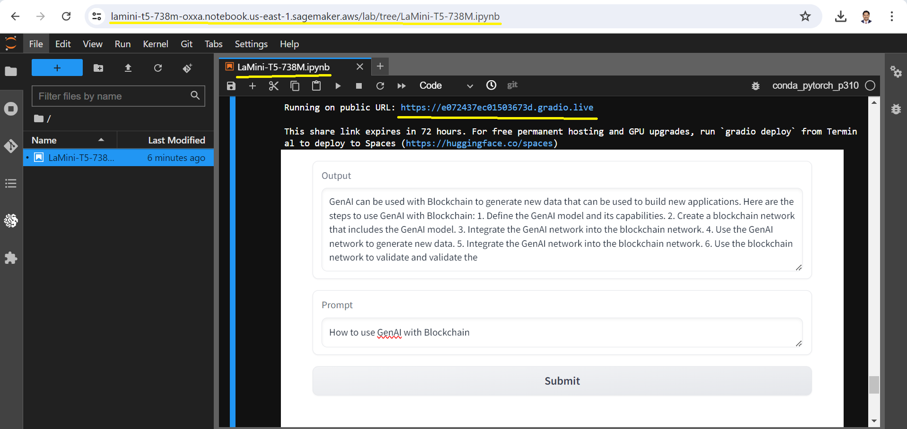

### Project: 
To deploy LaMini-T5-738M llm in Amazon Sagemaker and create an inference endpoint using Hugging Face Deep Learning Container for text2text-generation task. 

### 🛠️ Tech Stack:
1. [LaMini-T5-738M](https://huggingface.co/MBZUAI/LaMini-T5-738M)
2. Amazon Sagemaker
3. Hugging Face Deep Learning Container (DLC)
4. Python 3.10
5. Pytorch
6. Gradio

### Prerequisites:
1. **Install the below libraries using pip:**
   ```
   !pip install transformers einops accelerate bitsandbytes
   !pip install langchain langchain-community gradio
   !pip uninstall -y sagemaker
   !pip install sagemaker 
   ```
### Project Architecture:

### Work Done:
1. Created a domain in Amazon Sagemaker for managing and organizing the machine learning workloads.
   


2. Created a notebook instance (ml.c5.2xlarge) which is pre-installed with popular libraries for machine learning and to keep the compute environment secure for LaMini-T5-738M.


3. Installed the required libraies and deployed the model with instance_type="ml.g4dn.xlarge" using Hugging Face Deep Learning Container. Refer the sagemaker jupyter notebook [LaMini-T5-738M](LaMini-T5-738M.ipynb)

4. Noted the Endpoint created under the inference section in Amazon sagemaker.
       


5. Tuned the model with hyperparameter payload and integrated the sagemaker endpoint with a gradio app.
       


6. Launched the gradio app with a public URL for LaMini-T5-738M text2text-generation task ineference.
       


